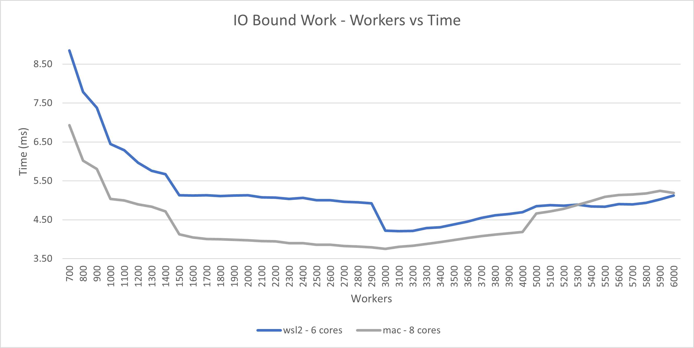

Hi there! I wanted to make a blog post showing some of the cool things I have learnt about Go over the past 4 years.
Its a great language and extremely practical for a plethora of backend tasks. With every release, the language just keeps getting better.

One of the things I have always been fascinated by with regards to computers was parallelism. Naturally when I started learning go,
I made a point to check out all its concurrency features. And now I am writing a blog post on some of them! What's more, is that recently go 1.19 came out and it has support for generics! So what better way to showcase all this learning with some generic fun at the same time.

Below is an implementation of parallel doer that takes some array of work, fans it out to a set of workers and then collates the results:

```go

func Do[I any, O any](work []I, workFunc WorkFunc[I, O], workers int, bufferSize int) []Result[I, O] {
	workC := make(chan I, bufferSize)
	resultC := make(chan Result[I, O], bufferSize)
	results := make([]Result[I, O], 0, len(work))

	var wg sync.WaitGroup
	wg.Add(workers)
	for i := 0; i < workers; i++ {
		go func() {
			defer wg.Done()
			for w := range workC {
				o, err := workFunc(w)
				resultC <- Result[I, O]{w, o, err}
			}
		}()
	}

	// load up the work
	go func() {
		defer close(workC)
		for _, w := range work {
			workC <- w
		}
	}()

	// close results channel if all workers are done
	go func() {
		wg.Wait()
		close(resultC)
	}()

	// capture all results
	for r := range resultC {
		results = append(results, r)
	}

	return results
}
```

If you like it you are most welcome to use it. You can find it [here](https://github.com/chrisjpalmer/chrisjpalmer.github.io/tree/master/playground/parallelism_in_go/parallel/parallel.go).

I have always been fascinated my Go's concurrency model. A friend once told me "goroutines are faster than threads". I couldn't quite believe it at the time... *how can they be faster than threads?*. Upon further research I found that this statement wasn't quite true. Go routines run on threads so they themselves couldn't be *faster* than threads! What my friend was talking about though is the usefulness of goroutines for handling a particular workload type that appears commonly in web servers: IO bound work.

## IO bound work

IO bound operations are system calls, reads/writes to disk, or an http request... anything that your application isn't executing, but is *waiting* for it to complete.
For example, if your application fires an http request to `https://google.com`, it has to wait for the response from google. While its doing this, your application is idle and its not executing anything. Applications run on threads and when the thread becomes idle, the OS puts it to sleep and runs a different one. This helps to utilize the processor fully. The problem is that the threading model is heavy and switching between threads costs a lot of CPU cycles. The advantage of goroutines is that they are significantly lighter and context switching only comes with a small penalty. When a go application boots, it firstly spins up a small pool of threads (called logical processors) and constantly switches go routines on and off these threads, to keep the threads as busy as possible. In a web server where you deal predominantly with IO bound work, this is great. Thousands of goroutines can be spawned with a minimal performance penalty.

To show how smart I am, I wanted to demonstrate this for the blog post: I set up a test using the above parallel `Do` function.
The test creates 3000 units of work, runs `Do` and records how long it took. The test is run repeatedly and each time the workers are increased by 100.
To negate the effects of random interference on the machines I was testing, I ran each test 3 times and took the average of the results. For more good tips on how to take proper bench marks read [Dave Cheney's blog post](https://dave.cheney.net/tag/benchmarking)... its really good!

My `Do` function requires a generic `WorkFunc` as an argument. This is the function it will call to "get the work done" on each worker. To simulate IO bound work, I constructed the simplest work function that waits 1 millisecond before returning. During that 1ms, the processor is doing nothing, simply waiting for time to pass so its a good candidate for IO bound work.


```go
func BenchmarkDoIOBoundWork(b *testing.B) {
	workUnits := 3000
	maxWorkers := 6000
	bufferSize := 3000
	work := make([]uint64, workUnits)
	for ws := 0; ws <= maxWorkers; ws += 100 {
		_ws := ws
		if _ws == 0 {
			_ws = 1
		}
		b.Run(fmt.Sprintf("workers %d", _ws), func(b *testing.B) {
			for i := 0; i < b.N; i++ {
				Do(work, ioBoundWorkFunc, _ws, bufferSize)
			}
		})
	}
}

// the work function
func ioBoundWorkFunc(_ uint64) (uint64, error) {
	time.Sleep(1 * time.Millisecond)
	return 0, nil
}
```

Before I ran this function my hypothesis was that with 1 worker, `Do` would take (3000x1ms) 3s to complete all the work since each the work function would have to be run 3000 times one after the other. I hypothesized that as the workers increased to 3000, this value would approach `1ms` since all 3000 units of work were being run at the same time.
Here were the results:

Initially the `Do` takes roughly 4 seconds to complete.


As the workers increased to 3000, the time approached 3.5ms.
As the workers increased beyond 3000, the time increased slightly.



I wasn't sure why the best result wasn't 1ms, but I guessed that some extra time was being added somewhere.
The fact that the time increased after 3000 workers made make sense to me though. Since there are only 3000 units of work in the test, there were no benefits after spinning up 3000 workers. The extra time was likely attributed to the cost of creating go routines and managing them on the scheduler.

Overall however, the results were what I wanted to see: You can spin up a large amount of goroutines with a minimal penalty to perform IO bound work.


