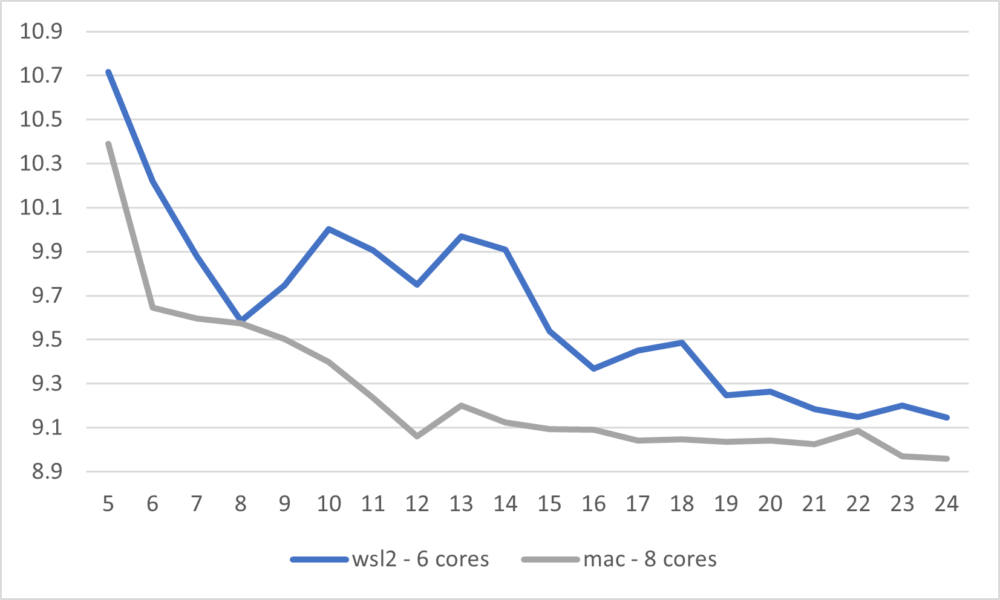
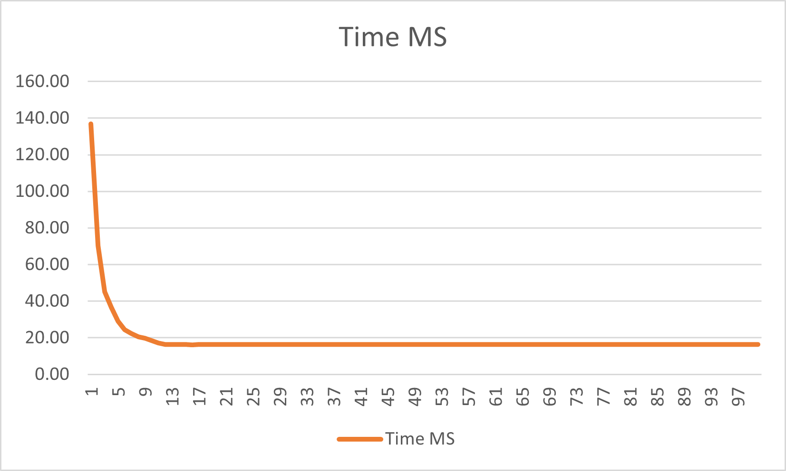

Hi there! This is a part twoer to my first post on Parallelism in Go.
In my first post I explored parallelism with IO Bound Work - a particular type of workload which Go is very well designed to handle.

In this post I wanted to explore go's parallelism characteristics around CPU Bound work. Now disclaimer: I went into this experiment fishing for a particular result, and I kind of only started to see it after a lot of testing... I mean a lot. And I just want to be honest about this because this is how it is in the software world - a lot of trial and error. Yes the answers exist out there, but there is often a journey which must be undertaken to discover them first.

So let me take you through that journey...

## Hypothesis

I have been doing Go for a while and read numerous articles about parallelism over the years. Some of my favourites are the Arden Labs ones. Please check them out :)

The general consensus behind CPU bound work is this: You can't get more throughput than the number of logical processors.

Lets break that down. What is a logical processor?

A logical processor is essentially an execution context where your go programming can get some work done, and in real world terms this translates to a thread. The reason Go chooses to call them "logical processors" is because Go only spins up a small pool of them. Specifically it spins up as many as there are cores on your computer. And if your computer has hyperthreading enabled, it spins up twice as many logical processors. This means on my 6 core Windows Machine, Go always spins up 12 logical processors. The thought bubble behind this is that, spinning up any more than this will yield no more improvement in throughput due to parallelism. Go is recognising the physical limitations of the machine its running on, so its not going to bother pushing beyond that. In fact, pushing beyond that would theoretically degrade performance because you would incur additional overheads from context switching threads as the CPU tries to give all threads equal time.

If the physical resources are the limitations for logical processors, then it makes sense that the logical processors are the limiting factor for how many goroutines you can spin up to perform CPU bound work. Now the key here is "Cpu Bound" because IO Bound work doesn't use the CPU. The goroutine waiting for the IO bound operation (network, disk, syscall) is put to sleep and another goroutine is put in its place on that logical processor. Conversely with CPU bound work, we are referring to work loads which primarily use the CPU. Examples of such workloads are iterating a loop, adding two numbers together or hashing a string. In the case of CPU bound work, given that the CPU is the limiting factor it makes sense that you shouldn't be able to run more goroutines than logical processors, and experience an increase in throughput.

I thought this would be very easy to prove, so I quickly drafted up my next bench mark experiment to show it in action. What I found is that, this wasn't so easy to prove after all and the story is a little more complicated... thats okay I like complicated :)

## Experiment 1

Using the same parallel `Do` function in the previous blog post (which you can find in the [examples]()), I prepared my next victim:

```go
func BenchmarkDoCPUBoundWork(b *testing.B) {
	workUnits := 3000
	maxWorkers := 24
	bufferSize := 3000

	// create 3000 units of work
	work := make([]string, workUnits)
	for i := 0; i < workUnits; i++ {
		work[i] = "work" + strconv.Itoa(i)
	}

	// run a benchmark, increase workers by 1 and run the next benchmark...
	// repeat until we reach 24 workers
	for ws := 1; ws <= maxWorkers; ws++ {
		b.Run(fmt.Sprintf("workers %d", ws), func(b *testing.B) {
			for i := 0; i < b.N; i++ {
				Do(work, cpuBoundWorkFunc, ws, bufferSize)
			}
		})
	}
}

// cpuBoundWorkFunc - does some heavy duty cpu bound work
// hashes the input 10000 times on itself and returns the result
func cpuBoundWorkFunc(input string) (uint64, error) {
	const hashLoopCt = 10000
	h := murmur3.New64()
	buf := []byte(input)
	var out uint64
	for i := 0; i < hashLoopCt; i++ {
		h.Write(buf)
		out = h.Sum64()
		buf = []byte(strconv.FormatUint(out, 10))
	}
	return out, nil
}
```

I ran the benchmarks on all three environments I tested in the last post:
- WSL running on my windows - 6 cores
- Windows - 6 cores
- Mac - 8 cores

Here were the results I got:


The first observation I made from these results were that, predictably, as you increase the workers, the overall time decreased.
This makes sense since you are utilizing the system resources in parallel as you increase workers, therefore gettinga time advantage.

What I was hoping to see as well was a clear and obvious plateau in performance once you increased workers to the same number of logical processors that each machine had.
For Mac this was 16 and for Windows and WSL this was 12:


This is where the results were not so kind to me. There was really no relationship between the count of logical processors and workers.
For Windows, yes it performed well at 12 (better than previous results), but saw even better results as you increased the workers beyond 12!
For WSL, it performed worse at 12 than it did for 7 and 24.
Similarly for Mac, it performed best at 8 and worse after 13!

I could not understand why I got these results... why isn't the magic number = logical processors!

This led me to another experiment

## Experiment 2

I suspected that the test wasn't intense enough so it wasn't pushing the CPU to its maximum capacity. Perhaps when workers were increased beyond logical processors, although theoretically there shouldn't be more throughput due to saturating CPU resources, there was a chance that the CPU was actually turboing at this time, leading to better performance. Modern CPUs are lazy and typically run at a slower clock speed when there isn't much work to do. This is to save power and increase the life of the CPU. This means that unless you are really pushing the CPU to its limits, you may not get the most out of it. With this in mind, I decided to run the experiment again but this time make the CPU do more work!

```diff
func BenchmarkDoCPUBoundWorkV2(b *testing.B) {
-   workUnits := 3000
+   workUnits := 30000
	...
	// all the same
}
```

Running the tests again these are the results I saw. I only tested these on my Mac and WSL:




Like before, I observed a decrease in execution time as the workers were increased. Once again this was to be expected. The mac result seemed to make more sense now too because unlike the previous results, were execution time increased after 8 workers, this time around it followed the WSL results and trended downwards.

The problem was however I was still seeing results where workers > logical processors out performed workers = logical processors.
It was at this point I turned to cpu/memory profiles and execution traces to find the answers.

After comparing several CPU traces I didn't find anything particularly interesting.
However the memory trace was telling me something. There were huge byte array allocations in my code. Over the course of the test the application allocated over 16Gb of memory. Obviously 16Gb wasn't live the whole time (coz it would have been cleaned up by the GC)... but it led me to think my results could be being impacted by the GC.

This led me to another aside on the GC where I ended up reading this [wonderful article](https://tip.golang.org/doc/gc-guide) on how the GC works. I was searching for some information which might support a new running theory I had: increased workers beyond logical processors, although incurring a scheduler penalty, might actually be benefiting the GC in some way. I still can't be sure whether the GC was the problem with these tests but I did note that the GC mark phase cannot complete until a goroutine is put to sleep. In the case where workers = logical processors, all workers were being kept as busy as possible so they probably didn't want to sleep. In cases like this the GC can issue a penalty to those workers by introducing a write barrier OR also making that worker do something called gcAssist. Gc Assist is when a goroutine is forced by the GC to stop what its doing and participate in the mark phase (mark phase is the phase when the GC discovers all the live allocations). It was possible because all my goroutine workers were so busy that they were actually incurring GC penalties and perhaps a larger number of workers made it easier for the GC to mark memory coz they would sleep more regularly.

When I viewed the execution traces, I definitely saw that for workers = 24, go routines were frequently switched off logical processors where as for workers = 12, goroutines could stay on for much longer. Could this be a contributing factor... ? I never dug deep enough to find out. 

However it got me thinking, what if I eliminated the memory factor altogether and made this test as CPU bound as possible.

## Experiment 3

My theory was that either allocations or the GC (or both) were contributing to my tests somehow, so I wanted to build a better work function which minimized their effects. I did some analysis on the work function:


```go
/*1*/ func cpuBoundWorkFunc(input string) (uint64, error) {
/*2*/ 	const hashLoopCt = 10000
/*3*/ 	h := murmur3.New64()
/*4*/ 	buf := []byte(input)
/*5*/ 	var out uint64
/*6*/ 	for i := 0; i < hashLoopCt; i++ {
/*7*/ 		h.Write(buf)
/*8*/ 		out = h.Sum64()
/*9*/ 		buf = []byte(strconv.FormatUint(out, 10))
/*10*/ 	}
/*11*/ 	return out, nil
/*12*/ }
```

I found:
1. on line 9, I was allocating a string on every iteration of the loop
2. on line 4, I was allocating a byte array every time `cpuBoundWorkFunc` was called

Whats more is after doing some escape analysis, I also found that the buffer being passed to `h.Write(buf)` was escaping to the heap:

```sh
go build -gcflags=-m=3 github.com/spaolacci/murmur3
go test -gcflags=-m=3 -c ./playground/parallelism_in_go/parallel_cpu_bound_2_test.go
```

This was apparently happening due to the internals of murmur3. Specifically somewhere internally a range was being taken from this byte slice. This is grounds for Go to allocate the byte array to the heap so it was escaping to the heap.

I wanted to eliminate heap allocations so I dreamed a new `Do` function that could maintain a shared state per worker goroutine:

```go
//parallel.go

func DoWithState[I any, O any, S any](work []I, stateFunc StateFunc[S], workFunc WorkFuncWithState[S, I, O], workers int, bufferSize int) []Result[I, O] {
	...
	var wg sync.WaitGroup
	wg.Add(workers)
	for i := 0; i < workers; i++ {
		go func() {
			s := stateFunc() // create a shared state when the worker goroutine starts.
			defer wg.Done()
			for w := range workC {
				o, err := workFunc(s, w) // pass that shared state to the work function
				resultC <- Result[I, O]{w, o, err}
			}
		}()
	}
}
```

Then I created a new work function and a function to initialize the shared state:

```go
func cpuBoundWorkFuncV3State() []byte {
	return make([]byte, 8)
}

func cpuBoundWorkFuncV3(byteArray []byte, input uint64) (uint64, error) {
	const hashLoopCt = 10000
	for i := 0; i < hashLoopCt; i++ {
		binary.LittleEndian.PutUint64(byteArray, input)
		input = murmur3.Sum64(byteArray)
	}
	return input, nil
}
```

My new work function would obviously not produce the same output, but it was more or less doing the same thing and this time avoiding allocations on every iteration of the loop. I hoped this would eliminate the noise factor which I hypothesized was coming from the GC.

Here were my results:


I noticed right away this strange peak at workers = 2 than hadn't cropped up before. I found this weird since it didn't make sense that an increase in parallelism was also increasing execution time! Oh well, it certainly revealed that this work function had very different characteristics to the last one!

Without fail however, I continued to see execution time trend downwards after workers > logical processors! It couldn't be alluded!

Once again I turned to cpu profiles, memory profiles and execution traces.

This time the memory trace was very boring. Hardly any memory was being allocated for the whole test. However when comparing CPU profiles between workers = 12 and workers = 24, I couldn't see any obvious reason why workers = 24 was faster than the other. I was so baffled by this result I started to wonder whether somehow ramping the workers up to 24 was actually "warming" up the CPU better, making the workers = 24 test run faster. To be sure, I actually ran the tests backwards:

```go
func BenchmarkDoCPUBoundWorkV3Backwards(b *testing.B) {
	workUnits := 300
	maxWorkers := 24
	bufferSize := 3000
	work := make([]uint64, workUnits)
	for i := 0; i < workUnits; i++ {
		work[i] = uint64(i)
	}
	for ws := maxWorkers; ws > 0; ws-- {
		b.Run(fmt.Sprintf("workers %d", ws), func(b *testing.B) {
			for i := 0; i < b.N; i++ {
				DoWithState(work, cpuBoundWorkFuncV3State, cpuBoundWorkFuncV3, ws, bufferSize)
			}
		})
	}
}
```

Astonishingly I got the same results. For some unknown reason, workers = 24 just performed better.

I started to look into the CPU profiles of individual lines of the murmur hash function. This is where I got another hunch. It seemed that between 12 and 24 worker tests particular lines of code in murmur3 just performed better for workers = 24. I wondered if this might have something to do with alignment of memory and cache lines. Its impossible to know because I just don't have that much in-depth knowledge. However it gave me one lust hunch... perhaps murmur3 is just such a complex function itself, that its creating situations where for no apparent reason a higher number of workers favour it. This led me to one last test...

### Experiment 4

No more murmur.. this time I made the simplest work function conceivable with 0 memory allocations:

```go
func cpuBoundWorkFuncV4(input uint64) (uint64, error) {
	var i uint64
	var x uint64
	for ; i < 1000000; i++ {
		x = i % 2
	}
	return x, nil
}
```

This function does nothing more than operate in a tight loop. The only reason I added lines like `x = i % 2` was to prevent the go compiler from optimising out my variables. I thought go probably doesn't know how to optimize the result of `x` in this situation so this would be a good way to make the CPU do some work.

I ran the test and these were my results:




The test results showed something different this time. Instead of the execution time trending down as workers increased beyond 12, it was trending up. Still the optimium number of worker go routines was not 12, however at least I was starting to see that additional go routines was incurring a schedule penalty as predicted.

In fact the results were even more apparent when I ran it all the way up to 100 workers:


This result got me pretty excited. So I ran with even more workers and performed 3 test runs to make sure I wasn't running into any noise from the machine:


.. and more workers:


Okay finally I could see what I was looking for! Taking the trendline each time, I found that there was a 0.0005ms (500μs) scheduler penalty per goroutine.
As for the magic number 12, I could not find it. In repeats of the test it just didn't show up:


However what I did notice is that there seems to be random noise in all the results. For example, comparing 3 individual back to back runs of the test, the results don't exactly align with each other:


This suggested to me that perhaps its impossible to see the 500μs penalty between workers = 12 and workers = 13. Perhaps that just wasn't going to possible given that my personal computer always has some degree of noise.

## Conclusion

Although I coulodn't find the magic number workers = logical processors, I can see with a reasonable degree of confidence that workers = logical processors is the point at which you get the most reasonable optimization with CPU bound work.s

